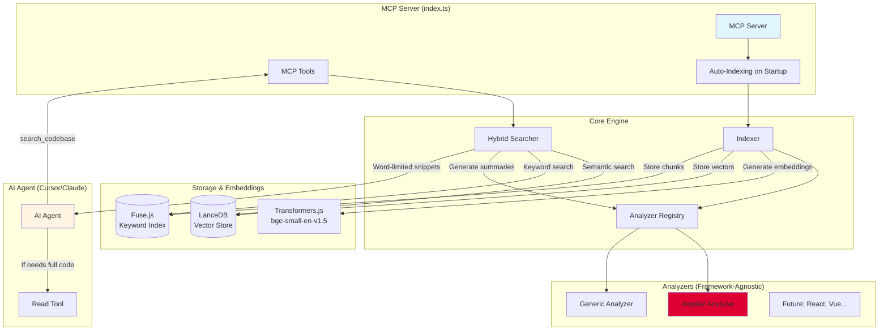
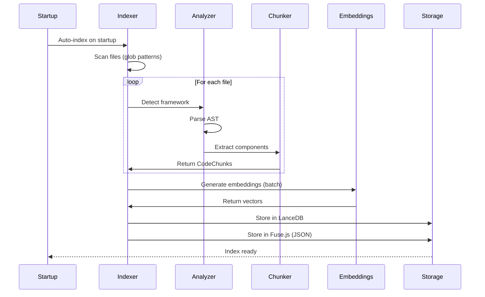
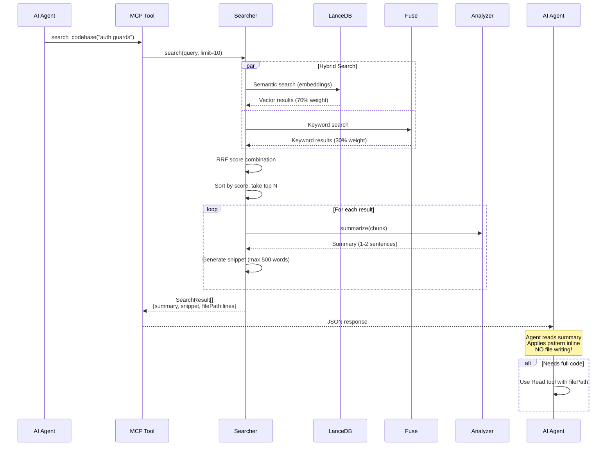
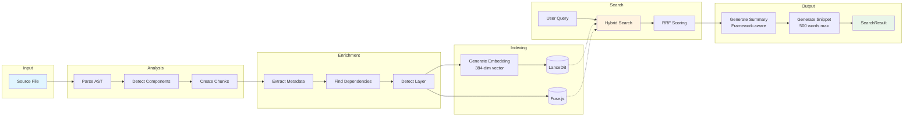
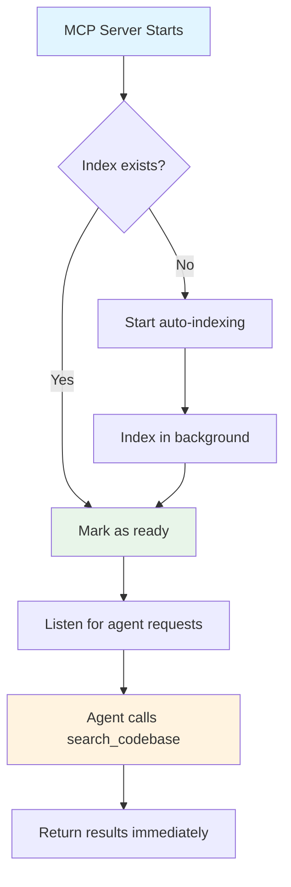
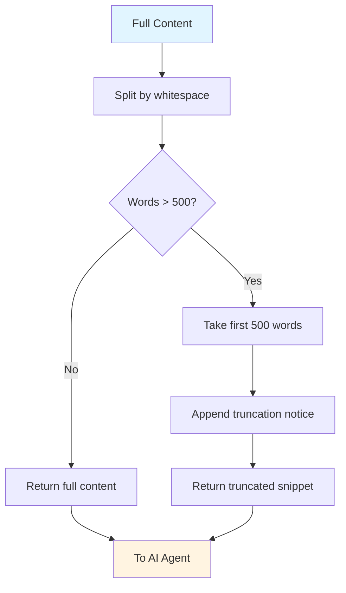

# Codebase Context MCP - Architecture

## System Overview



## Indexing Flow



## Search Flow (New: Summary + Snippet)



## Data Transformation Pipeline



## Key Design Decisions

### 1. Auto-Indexing (Not Agent-Triggered)



**Why:**
- No latency waiting for agent
- Agent doesn't manage infrastructure
- Simpler mental model

### 2. Summarization Pipeline (Framework-Agnostic)

```mermaid
flowchart LR
    Chunk[CodeChunk] --> Check{Has framework?}
    Check -->|Yes| GetAnalyzer[Get framework analyzer]
    Check -->|No| Generic[Use generic analyzer]

    GetAnalyzer --> HasSum{Has summarize()?}
    HasSum -->|Yes| AngSum[Angular/React/Vue<br/>specific summary]
    HasSum -->|No| Generic

    AngSum --> Summary
    Generic --> Summary[Summary String]

    Summary --> Agent[To AI Agent]

    style Chunk fill:#e1f5ff
    style Summary fill:#e8f5e9
    style AngSum fill:#dd0031
    style Generic fill:#gray
```

**Example Outputs:**
- **Angular:** "Angular CanActivate guard 'RoleGuard' (selector: app-role) with ngOnInit, 2 inputs."
- **Generic:** "TypeScript class 'UserService' in user.service.ts."

### 3. Word Limits (Not Line Limits)



**Why Words not Lines:**
- Lines vary wildly (1 word vs 200 words)
- Words are intuitive and consistent
- 500 words ≈ 1-2 screenfuls of code

## Old vs New Response Format

### ❌ Old (87KB dumps)

```json
{
  "results": [
    {
      "content": "... 2000 lines of code ...",
      "filePath": "src/guards/role.guard.ts",
      "score": 0.92
    }
  ]
}
```

**Problems:**
- Agent overwhelmed with data
- Writes to files instead of using inline
- Can't quickly understand what code does

### ✅ New (Concise summaries)

```json
{
  "results": [
    {
      "summary": "Angular CanActivate guard 'RoleGuard' protecting routes with role checks.",
      "snippet": "export class RoleGuard implements CanActivate {\n  constructor(private auth: AuthService) {}\n  canActivate() {\n    return this.auth.hasRole('admin');\n  }\n}",
      "filePath": "src/guards/role.guard.ts:15-45",
      "score": 0.92,
      "componentType": "guard",
      "layer": "core"
    }
  ],
  "hint": "Use Read tool with filePath for full code if needed"
}
```

**Benefits:**
- Agent reads summary first
- Sees pattern in snippet
- Applies inline immediately
- Only reads full file if needed

## Component Interaction Matrix

| Component | Reads From | Writes To | Key Responsibility |
|-----------|------------|-----------|-------------------|
| **MCP Server** | Agent requests | Agent responses | Tool orchestration, auto-indexing trigger |
| **Indexer** | File system | LanceDB, Fuse.js | Parse files → chunks → embeddings |
| **Analyzer Registry** | Analyzer plugins | Indexer | Route files to correct analyzer |
| **Angular Analyzer** | TypeScript AST | CodeChunks | Angular-specific parsing & summarization |
| **Generic Analyzer** | Code patterns | CodeChunks | Fallback for any language |
| **Searcher** | LanceDB, Fuse.js | SearchResults | Hybrid search + summarization |
| **Transformers.js** | Text chunks | Embeddings (384-dim) | Local embedding generation |
| **LanceDB** | Embeddings | Vector search results | Semantic similarity search |
| **Fuse.js** | JSON chunks | Keyword results | Fast keyword matching |

## File Structure

```
codebase-context-mcp-v2/
├── src/
│   ├── index.ts                 # MCP Server (auto-indexing, tools)
│   ├── core/
│   │   ├── indexer.ts           # File scanning → chunks → embeddings
│   │   ├── search.ts            # Hybrid search + summarization
│   │   └── analyzer-registry.ts # Analyzer plugin management
│   ├── analyzers/
│   │   ├── angular/index.ts     # Angular-specific logic + summarize()
│   │   └── generic/index.ts     # Generic fallback + summarize()
│   ├── embeddings/
│   │   └── transformers.ts      # Transformers.js provider
│   ├── storage/
│   │   └── lancedb.ts           # LanceDB vector storage
│   ├── types/index.ts           # Core interfaces (NEW: SearchResult)
│   └── utils/
│       ├── chunking.ts          # AST-aware code chunking
│       └── language-detection.ts
├── docs/
│   └── ARCHITECTURE.md          # This file
└── SPEC.md                      # High-level specification
```

## Success Metrics

| Metric | Target | Current Status |
|--------|--------|----------------|
| **Index Time** | < 3 min for 5K files | ✅ 75s for 614 files |
| **Search Latency** | < 500ms | ⏳ To measure |
| **Result Size** | < 5KB per result | ✅ ~500 words max |
| **Agent Behavior** | Uses inline, no file writes | 🎯 Testing needed |
| **Precision@5** | > 80% relevant | 🎯 Testing needed |
| **Memory Usage** | < 2GB during indexing | ✅ ~500MB |

## Next Steps

1. **Test with Cursor** - Verify agent doesn't write files
2. **Measure quality** - Are summaries helpful? Are snippets adequate?
3. **File watching** - Auto re-index on file changes
4. **Cache summaries** - Don't regenerate on every search
5. **More analyzers** - React, Vue, Python support
